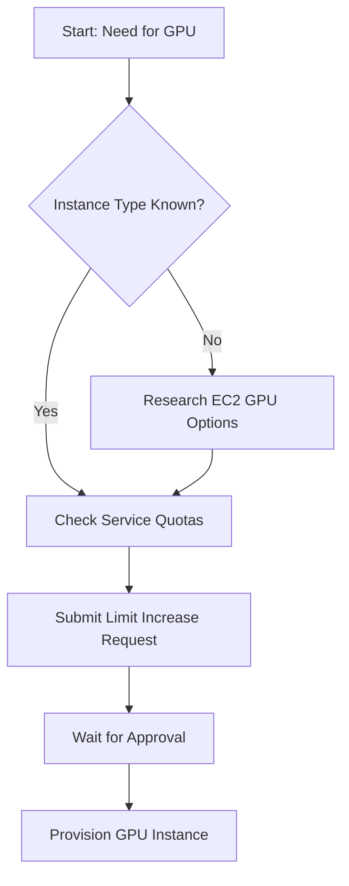

<h1 align="center">Prerequisites Before Deploying ARRAT</h1>

You will need the following technologies to successfully deploy your system to AWS.

## AWS CLI

> \[!TIP]
>
> Learn the most up to date steps to set up the [AWS CLI][docs-aws-cli-download-link] by checking it out.

**🚨 Remember:** Configure your profile locally following this [guide][docs-aws-profile-setup-link]. This will be used in the coming steps when deploying templates.

### AWS SAM CLI

After following the prerequisites, download the [AWS SAM CLI][docs-aws-sam-cli-download-link] used to run and deploy AWS SAM templates.

## Nodejs / pnpm

> \[!TIP]
>
> Learn the most up to date steps to set up [Node.js][docs-nodejs-download-link] by checking it out.

_Once installed, run the following command to download `pnpm`:_

<div align="center">

  <picture>
    <source media="(prefers-color-scheme: dark)" srcset="/images/install-pnpm-command.png">
    
  </picture>

</div>

## Docker

> \[!TIP]
>
> Learn the most up to date steps to set up [Docker][docs-docker-download-link] by checking it out.

## 🚀 Requesting GPU Access from AWS

This repository provides guidance and templates for requesting GPU-based EC2 instances from AWS, including best practices, IAM policies, request steps, and usage tips.

### 📌 Overview

Amazon Web Services (AWS) offers GPU-enabled EC2 instances (e.g., `g4dn`, `p3`, `p4`) for compute-intensive workloads like machine learning, video processing, and scientific simulations. Access to these instances may require a service limit increase or internal approval before provisioning.

### 📋 Prerequisites

- AWS account with permissions to request limit increases.
- Knowledge of your region and instance type requirements.

### 📥 How to Request GPU Access

#### Step 1: Identify the Instance Type

Choose an appropriate instance type based on your use case:
| Instance Type | Use Case                          | Memory | GPU Count |
|---------------|-----------------------------------|--------|-----------|
| `g4dn.xlarge` | Light usage                       | 16 GB  | 1 NVIDIA T4 |
| `p3.2xlarge`  | Moderate usage                    | 61 GB  | 1 NVIDIA V100 |
| `p4d.24xlarge`| Heavy usage                       | 1152 GB| 8 NVIDIA A100 |

[🔍 EC2 Instance Types](https://aws.amazon.com/ec2/instance-types/)

#### Step 2: Check Current Service Quotas

You can check your current GPU instance limits in:
- **AWS Console** → [Service Quotas](https://console.aws.amazon.com/servicequotas/)
- **EC2 Dashboard** → Limits tab

Example CLI:
```bash
aws service-quotas list-service-quotas --service-code ec2
```

#### Step 3: Submit a Limit Increase Request

1. Go to the **[AWS Service Quotas Console](https://console.aws.amazon.com/servicequotas/)**  
2. Search for your desired GPU instance family (e.g., `Running On-Demand G4 Instances`).  
3. Select the **region**.  
4. Click **Request quota increase**.  
5. Enter your desired quota (e.g., 4 vCPUs or 2 instances).  
6. Provide a strong justification (see template below).

### 📝 Sample Request Justification Template

```text
We are deploying a data processing pipeline for [insert project name].
The processing requires GPU acceleration for both training and inference tasks.
We plan to use g4dn.xlarge instances across two Availability Zones to ensure fault tolerance and performance.
Initial usage is estimated at 100 hours/month, scaling up based on results.

Please grant access to run up to 2 g4dn.xlarge instances in the us-east-1 region.
```

### ✅ Best Practices

- **Start small**: Request modest access first, then scale based on usage.
- **Track usage**: Use CloudWatch or Cost Explorer to monitor GPU spend.
- **Use Spot Instances** for cost savings in non-production workloads.
- **Use Auto Scaling** to manage peak GPU demand efficiently.

### 📊 Visual: Request Flow



### 📎 Resources

- [EC2 Pricing](https://aws.amazon.com/ec2/pricing/)
- [Amazon EC2 Spot Instances](https://docs.aws.amazon.com/AWSEC2/latest/UserGuide/using-spot-instances.html)
- [AWS CLI Reference](https://docs.aws.amazon.com/cli/latest/reference/)

### 🛡️ Permissions Note

Ensure your IAM role or user has the following permissions:
```json
{
  "Action": [
    "ec2:DescribeInstances",
    "ec2:RequestSpotInstances",
    "servicequotas:RequestServiceQuotaIncrease"
  ],
  "Effect": "Allow",
  "Resource": "*"
}
```

### 🙋‍♀️ Need Help?

Please open an issue in this repository or contact your AWS administrator or account manager for assistance.

## Continue to deploying the [pipeline and infrastructure][up-next-link]

<!-- Link Groups -->

[docs-docker-download-link]: https://docs.docker.com/desktop/
[docs-nodejs-download-link]: https://nodejs.org/en/download
[docs-aws-cli-download-link]: https://docs.aws.amazon.com/cli/latest/userguide/getting-started-install.html
[docs-aws-profile-setup-link]: https://docs.aws.amazon.com/cli/v1/userguide/cli-configure-files.html
[docs-aws-sam-cli-download-link]: https://docs.aws.amazon.com/serverless-application-model/latest/developerguide/install-sam-cli.html
[up-next-link]: https://github.com/arrat-tools/deploy/blob/main/guide/01-deploy-the-infrastructure.md
